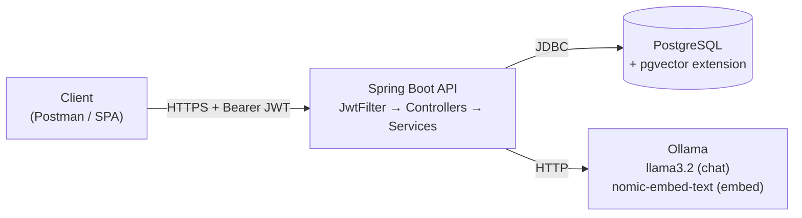
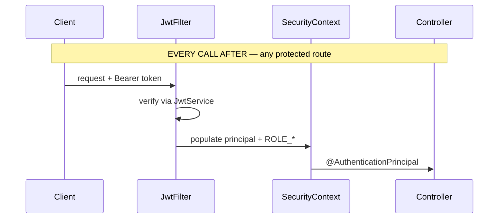
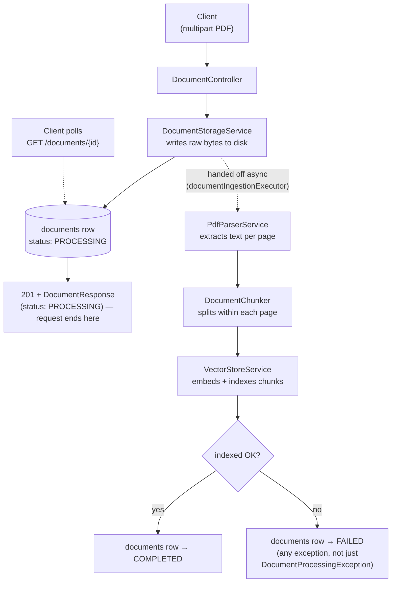
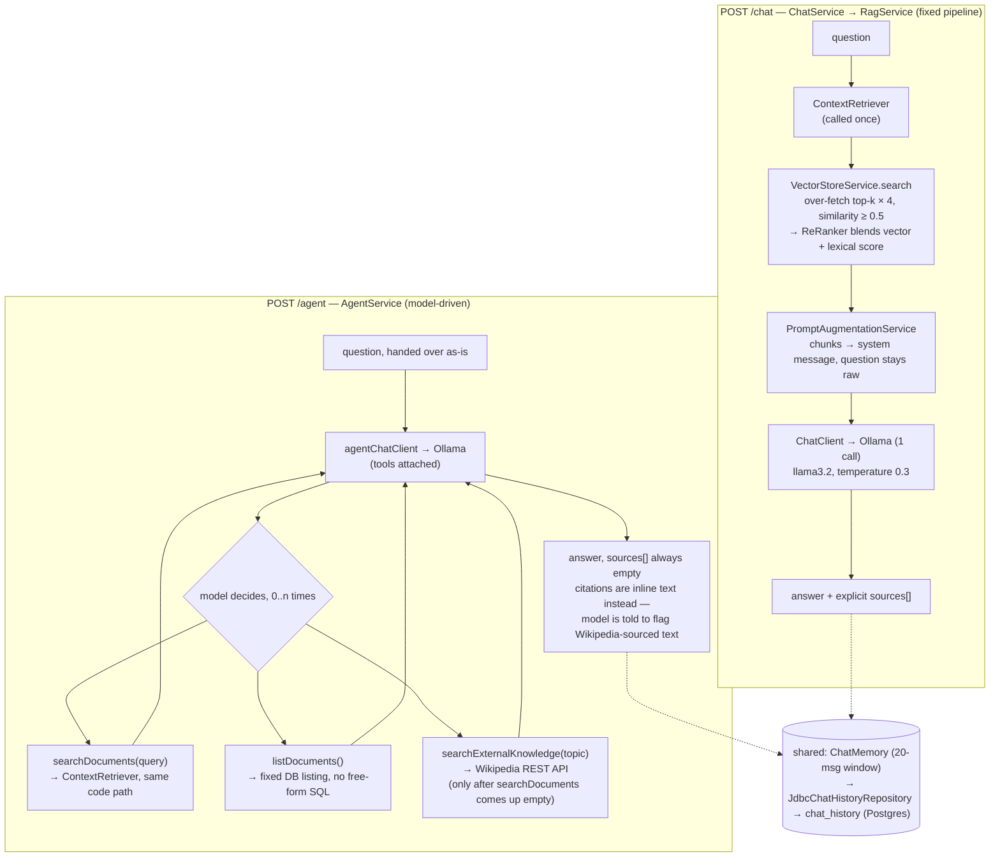

# AI Knowledge Assistant — Architecture & Data Flow

*Code understanding reference — companion to [`architecture.html`](architecture.html)*

A corporate RAG chat API: PDFs are parsed, chunked and embedded into pgvector; authenticated users then ask
questions that are answered strictly from that indexed content, with page-level citations. This document traces
how a request actually moves through the code, and how to exercise each endpoint from Postman.

**Stack:** Java 21 · Spring Boot 4 · Spring AI 2.0 · Ollama (llama3.2 + nomic-embed-text) · PostgreSQL + pgvector
· JWT (stateless) · Flyway

## Contents

1. [System map](#1-system-map)
2. [Auth & request security](#2-auth--request-security)
3. [Document ingestion](#3-document-ingestion--post-documentsupload)
4. [`/chat` vs `/agent`](#4-chat-vs-agent--two-strategies-one-index)
5. [Decisions worth knowing](#5-decisions-worth-knowing-before-you-change-this-code)
6. [API & Postman examples](#6-api--postman-examples)
7. [Schema, at a glance](#7-schema-at-a-glance)
8. [Running it locally](#8-running-it-locally)

---

## 1. System map

Every request enters through one Spring Boot process behind a JWT filter. That process is the only thing that
ever talks to Postgres/pgvector or Ollama — clients never call either directly, and the two downstream systems
never talk to each other.



The API mediates everything: request auth, document storage, retrieval, and generation all pass through it —
Postgres and Ollama each see only what the API sends them.

## 2. Auth & request security

Auth is stateless: no sessions, no CSRF, a signed JWT carries identity. `/auth/register` and `/auth/login` both
end by minting a token; every other route requires one, verified fresh on each call rather than against a
session store.

```mermaid
sequenceDiagram
    participant C as Client
    participant AS as AuthService
    participant JS as JwtService

    Note over C,JS: ONCE — POST /auth/login
    C->>AS: credentials
    AS->>AS: AuthenticationManager verifies via UserRepository
    AS->>JS: sign token
    JS-->>C: signed JWT (sub=email, roles)

    Note over C: client stores token, replays it as<br/>Authorization: Bearer &lt;token&gt;
```



Login happens once per session lifetime; verification happens on every single request — there is no
server-side session to short-circuit it.

**Public routes:** `/auth/**`, `/health/**`, `/actuator/**`, `/swagger-ui/**`, `/v3/api-docs/**`, and any
`OPTIONS` request — everything else requires a valid token (`SecurityConfig`).

**Roles: `USER`, `ADMIN`.** `/auth/register` always creates role `USER` — nothing in the API promotes a user to
`ADMIN`. See the Postman note on `DELETE /documents/{id}` below.

## 3. Document ingestion — `POST /documents/upload`

Upload returns as soon as the raw file is safely stored — parsing, chunking, embedding and indexing all happen
afterward on a background thread pool (`DocumentIngestionService`, `AsyncConfig`), so a large PDF no longer
makes the HTTP call hang for the whole pipeline. The client gets a `201` with `status: "PROCESSING"` immediately
and polls `GET /documents/{id}` (or `GET /documents`) to see it flip to `COMPLETED` or `FAILED`.



`DocumentIngestionService.ingest` catches *any* exception, not just `DocumentProcessingException` — it runs on
a background thread with no HTTP caller left to propagate an error to, so an uncaught exception there would
otherwise leave the row stuck in `PROCESSING` forever with the failure visible only in logs.

> **Worth knowing:** `PROCESSING` is no longer a narrow race-condition window — it's the normal status for
> however long ingestion takes after upload returns. A correlation id set by `CorrelationIdFilter` on the
> original request is carried across onto the ingestion thread (via a `TaskDecorator` on the executor), so its
> logs can still be tied back to the upload that triggered them.

## 4. `/chat` vs `/agent` — two strategies, one index

Both endpoints take the same `{ message, conversationId }` shape and both ground answers in the same pgvector
index and the same conversation memory. They differ in exactly one place: **who decides when to retrieve.**



`/chat` retrieves exactly once, always, before the model ever runs — predictable latency, and a sources list
the caller can render directly. `/agent` hands the model three tools it can call repeatedly (or not at all):
`searchDocuments` and `listDocuments` over the same index `/chat` uses, plus `searchExternalKnowledge` — the V4
spec's third, external-API agent — for general knowledge the documents don't cover. This suits questions one
retrieval can't answer, at the cost of extra round-trips and no attributable sources list.

## 5. Decisions worth knowing before you change this code

- **Context → system message, not the question.** `MessageChatMemoryAdvisor` persists only the last user
  message, so keeping retrieved chunks out of it means history stores the question asked, not a copy of every
  chunk retrieved for it.
- **`chat_history` ≠ Spring AI's shipped schema.** Spring AI's own table keys on a single 36-char
  `conversation_id`. This app's memory key is `"<userId>:<conversationId>"` (73 chars), so
  `JdbcChatHistoryRepository` unpacks it into two real UUID columns instead.
- **Chunking never crosses a page.** `DocumentChunker` splits each PDF page independently, so every chunk — and
  every citation — can be attributed to exactly one page. Costs slightly undersized chunks at page ends.
- **No "run this SQL" tool.** `listDocuments()` is a fixed, parameterless listing. A tool that accepted
  model-supplied SQL would hand an injection primitive to whatever text a user can talk the model into emitting.
  `searchExternalKnowledge` follows the same spirit: it only ever takes a topic string, never a raw URL, encoded
  into a fixed Wikipedia REST path template.
- **Retrieval over-fetches, then re-ranks.** Vector search alone decides on embedding proximity — anything just
  outside `top-k` is lost. Pulling `top-k × overfetch-factor` candidates and blending in lexical overlap
  (`ReRanker`) catches exact terms — product names, error codes — that embed close to, but not on, the right
  chunk.
- **pgvector image, not stock postgres.** `docker-compose.yml` pins `pgvector/pgvector:pg16`. Plain
  `postgres:16` can't satisfy `V2__create_extensions.sql`'s `CREATE EXTENSION vector` — this broke the project
  once already.
- **Ingestion is async; `DocumentService` and `DocumentIngestionService` are split accordingly.** The upload
  request only stores the file and returns; a separate bean does parse/chunk/embed/index on a bounded executor
  so `DocumentStatus.PROCESSING` reflects real background work rather than a request-scoped implementation
  detail (see §3).
- **The JWT secret has no default outside dev.** `application.yml`'s `${JWT_SECRET:...}` default only applies
  with no active profile. `application-prod.yml` overrides it with `${JWT_SECRET}` — no fallback — so the `prod`
  profile fails to start rather than silently running with the secret that's checked into source control.
- **A stateless JWT API needs an explicit `AuthenticationEntryPoint`.** Left unset, Spring Security's default for
  a request with zero credentials is `Http403ForbiddenEntryPoint` (403) — the wrong code for "not authenticated"
  (401). `SecurityConfig` sets `HttpStatusEntryPoint(HttpStatus.UNAUTHORIZED)` explicitly.

## 6. API & Postman examples

**Environment:** set `baseUrl` = `http://localhost:8080` and an empty `token` variable.

**Auto-capture the token:** on the register/login request's *Tests* tab —

```js
pm.environment.set("token", pm.response.json().token);
```

Then set every other request's *Authorization* tab to **Bearer Token** → `{{token}}`.

---

### `POST {{baseUrl}}/auth/register` — public

Creates a user (always role `USER`), hashes the password with BCrypt, and returns a token immediately so the
frontend can skip a second login call.

Body — raw JSON:

```json
{
  "name": "Ada Lovelace",
  "email": "ada@example.com",
  "password": "correct-horse-battery"
}
```

201 response:

```json
{
  "token": "eyJhbGciOiJIUzI1NiJ9...",
  "expiresIn": 86400000,
  "name": "Ada Lovelace",
  "email": "ada@example.com",
  "role": "USER"
}
```

### `POST {{baseUrl}}/auth/login` — public

Same response shape as register. Wrong credentials → `401` with `"Invalid email or password"`.

Body — raw JSON:

```json
{
  "email": "ada@example.com",
  "password": "correct-horse-battery"
}
```

400 — validation error shape (returned by every endpoint, via `GlobalExceptionHandler`):

```json
{
  "status": 400,
  "error": "Bad Request",
  "message": "Validation failed",
  "path": "/auth/register",
  "details": [
    "password: Password must be at least 8 characters"
  ]
}
```

### `POST {{baseUrl}}/documents/upload` — bearer required

Body type **form-data**, key `file` (type: File), a PDF only — anything else is a `400`. Max size 20 MB (`413`
above that). Returns as soon as the file is stored — parsing/chunking/embedding happens afterward in the
background, so the response always comes back `status: "PROCESSING"`, never `COMPLETED`/`FAILED` yet.

Postman body tab:

```
form-data
  file: [Select File] → some-policy.pdf
```

201 response:

```json
{
  "id": "3f2a9c1e-...",
  "filename": "some-policy.pdf",
  "contentType": "application/pdf",
  "sizeBytes": 184320,
  "status": "PROCESSING",
  "uploadedBy": "ada@example.com",
  "createdAt": "2026-08-10T14:02:11Z"
}
```

### `GET {{baseUrl}}/documents/{id}` — bearer required

Poll this after upload to see ingestion finish — `status` moves to `COMPLETED` or `FAILED`. `404` if the id
doesn't exist.

200 response:

```json
{
  "id": "3f2a9c1e-...",
  "filename": "some-policy.pdf",
  "contentType": "application/pdf",
  "sizeBytes": 184320,
  "status": "COMPLETED",
  "uploadedBy": "ada@example.com",
  "createdAt": "2026-08-10T14:02:11Z"
}
```

### `GET {{baseUrl}}/documents` — bearer required

Lists every document, newest first, regardless of who uploaded it.

200 response:

```json
[
  {
    "id": "3f2a9c1e-...",
    "filename": "some-policy.pdf",
    "contentType": "application/pdf",
    "sizeBytes": 184320,
    "status": "COMPLETED",
    "uploadedBy": "ada@example.com",
    "createdAt": "2026-08-10T14:02:11Z"
  }
]
```

### `DELETE {{baseUrl}}/documents/{id}` — ADMIN role required

Removes the document row, its stored file, and every indexed chunk. Returns `204` with no body; `403` if the
caller isn't `ADMIN`.

> **Postman setup:** registration only ever creates `USER`. To test this endpoint, promote a user directly:
> `UPDATE users SET role = 'ADMIN' WHERE email = 'ada@example.com';` — then log in again so the new token
> carries `ROLE_ADMIN`.

### `POST {{baseUrl}}/chat` — bearer required

Omit `conversationId` to start a new conversation; pass back the value from the response to continue one with
memory of prior turns (last 20 messages).

Body — raw JSON:

```json
{
  "message": "What does the security policy say about VPN access?",
  "conversationId": null
}
```

200 response:

```json
{
  "answer": "According to 'Security Policy.pdf' (page 4), ...",
  "conversationId": "9b6e1d2a-...",
  "sources": [
    { "filename": "Security Policy.pdf", "page": 4 }
  ]
}
```

### `POST {{baseUrl}}/agent` — bearer required

Identical request/response shape to `/chat`. Expect higher, more variable latency — the model may call
`searchDocuments` (and, for general-knowledge questions the documents don't cover, `searchExternalKnowledge`
against Wikipedia) more than once before answering. `sources` is always `[]`; citations appear inline in
`answer` instead, and the model is instructed to say explicitly when an answer came from Wikipedia rather than
the knowledge base.

Body — raw JSON:

```json
{
  "message": "Compare what the security policy and the onboarding guide say about laptops",
  "conversationId": null
}
```

200 response:

```json
{
  "answer": "The Security Policy (page 2) requires disk encryption... The Onboarding Guide (page 7) says laptops are issued on day one...",
  "conversationId": "c14f7a08-...",
  "sources": []
}
```

## 7. Schema, at a glance

Five Flyway migrations, applied in order on every boot (`V1`–`V5`).

| Table              | Key columns                                             | Purpose                                                                                                          |
|---------------------|----------------------------------------------------------|--------------------------------------------------------------------------------------------------------------------|
| `users`             | `email` (unique), `password` (BCrypt), `role`            | Auth identity. Indexed on `email` for login lookups.                                                             |
| `documents`         | `status`, `uploaded_by → users.id`                       | One row per uploaded PDF; lifecycle `PROCESSING → COMPLETED / FAILED`.                                           |
| `document_chunks`   | `embedding vector(768)`, `metadata json`                 | pgvector's own schema (Flyway-owned, not auto-initialized). HNSW index, cosine ops. 768-dim matches `nomic-embed-text`. |
| `chat_history`      | `user_id`, `conversation_id`, `message_type`             | Backs `ChatMemory` persistence. Two real UUID columns (not Spring AI's stock schema) so a user's conversations can be listed and cascade-deleted. |

## 8. Running it locally

```bash
# Postgres+pgvector, Ollama, and a one-shot model pull
docker compose up -d

# App on :8080 — Flyway applies V1-V5 on boot
./mvnw spring-boot:run

# ...or run the backend in a container too
docker compose --profile full up
```

`docker compose up` deliberately starts only the dependencies — the backend stays behind the `full` profile so
the usual dev loop (run from the IDE) doesn't rebuild an image every time.

**Outside local dev**, activate the `prod` profile and export a real secret first — the app won't start
without it:

```bash
export JWT_SECRET="$(openssl rand -base64 32)"
SPRING_PROFILES_ACTIVE=prod ./mvnw spring-boot:run
```

---

*Generated from the current state of `src/main/java/com/rensilver/ai_knowledge_assistant` — for the
authoritative source, read the code linked above each diagram.*
